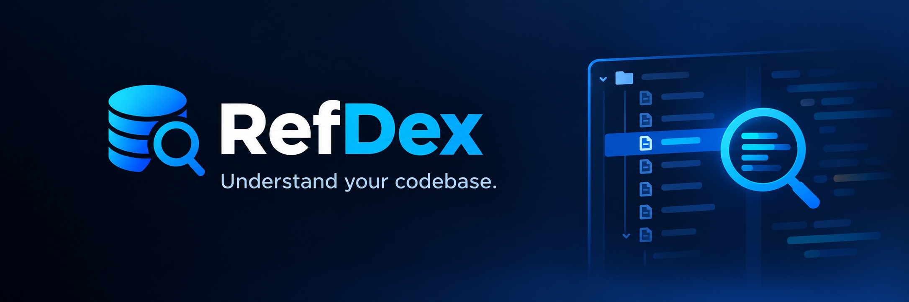

# RefDex

[](https://marketplace.visualstudio.com/items?itemName=danielonnet.refdex)
[](https://marketplace.visualstudio.com/items?itemName=danielonnet.refdex)
[](https://plugins.jetbrains.com/plugin/34561-refdex)
[](https://plugins.jetbrains.com/plugin/34561-refdex)

**A code index for AI assistants. Claude Code, GitHub Copilot and Junie can look code up instead of reading whole files, so each task uses fewer tokens and they find their way around a large codebase.**

RefDex parses TypeScript, Python, Java and C# into a local SQLite index of every class, method, function and property: signatures, doc comments, resolved imports and a call graph. An MCP server lets AI assistants query it. Instead of reading a 900-line file to find one method, the assistant asks for the file's outline, or for just that method, or for everything that calls it.

- **Prompt optimization:** the context window holds the code the task needs, not whole files around it. For example, Guava's 1,148-line `CacheBuilder.java` costs about 13,200 tokens to read whole, about 1,100 as an outline, and about 140 for one method.
- **Large codebases:** incremental, hash-based updates (a saved file in 40–60 ms on a generated 3,000-file project), background indexing, monorepo and namespace-aware import resolution, and a PageRank repo map that shows an assistant the core of an unfamiliar codebase first.
- **No setup:** inside VS Code, RefDex registers with Copilot automatically and connects to Claude Code with one command. In IntelliJ-based IDEs, one action connects Claude Code, Junie or Copilot. The index stays on your machine.

The VS Code Marketplace page, with features, tools, commands and settings, is [packages/vscode/README.md](packages/vscode/README.md). The IntelliJ plugin is described in [plugins/intellij/README.md](plugins/intellij/README.md). The design and roadmap are in [docs/refdex-project-plan.md](docs/refdex-project-plan.md).

## Status

| Part | State |
| --- | --- |
| VS Code extension | Published on the VS Code Marketplace (0.1.3) |
| IntelliJ plugin | 0.1.2 uploaded to the JetBrains Marketplace and waiting for JetBrains' review. Works in IntelliJ-based IDEs 2025.3 and later. Its zip bundles the daemon executable for Linux x64 only; on macOS and Windows it needs Node.js 22.13+ on PATH until CI builds those executables |
| Token benchmark | First results on Guava below. Next: other languages' repositories, Copilot, and measuring Claude Code with its tool search off |
| Open work | From Phase 5 of the plan: per-language fixture repos and a performance test on a large repo |

## Benchmark results

Does RefDex make an AI agent spend fewer tokens on the same task? [bench/](bench/README.md) runs the same questions in Claude Code with and without RefDex and checks every answer against the known one. Latest runs, 2026-10-03: RefDex `2379014`, Claude Sonnet 5, Claude Code 2.1.283, Guava at `4d41665af1` (3,275 Java files, 79,884 symbols).

Three setups, identical except for RefDex: **baseline** (no RefDex), **RefDex** (offered; the agent decides whether to use it, as in real use) and **directed** (RefDex plus one instruction to use it, which shows what it saves when used). Cost counts every token the model processed, priced as if nothing was cached before the run; the overall figure is the geometric mean of the per-task median ratios.

| Suite | Runs | Cost, RefDex | Cost, directed | Correct (baseline / RefDex / directed) | RefDex used (RefDex / directed) |
| --- | --- | --- | --- | --- | --- |
| [Callers and tests](bench/results/2026-10-03T18-54-44-guava-accuracy/report.md): 4 tasks | 3 per setup | **−12%** | **−12%** | 11/12, 10/12, 11/12 | 4 of 12 runs, 10 of 12 |
| [Flows and plans](bench/results/2026-10-03T19-14-03-guava-long/report.md): 5 tasks | 5 per setup | +2% | +8% | 25/25 in all three | 6 of 25 runs, 18 of 25 |

What the runs show:

- **Turns, not answer size, decide the cost.** Each tool call re-sends the whole conversation (about 35,000 tokens per turn here). RefDex saves where one call replaces several rounds of searching: finding the tests that reach a method through helpers took 5–7 turns instead of 12 (−20% offered, −31% directed), and callers through a base type cost 19% less.
- **On flow questions the gain is used up.** The agent looks names up one at a time, much as it reads files, and every session that uses RefDex spends one extra turn on Claude Code's `ToolSearch`, which loads deferred MCP tool definitions on first use. Searching several names per call would not help: the agent already makes most of its searches in parallel within a turn.
- **What changed to get here:** calls linked through declared types (Java, C#: 24% more calls linked on Guava, and `find_references` finds callers it missed before), `find_references` with two levels of callers and the callers' code by default and recommended first, `get_symbol_source` for several names, code with a single exact search match, and a smaller `get_context` (whose large answers had made flow questions 17–25% more expensive).

Reproduce with `node bench/run.ts --tasks bench/tasks/guava-accuracy.json --source <guava checkout> --runs 3 --arms baseline,refdex,directed`, then `node bench/report.ts <results folder>`.

## Layout

| Path | Contents |
| --- | --- |
| `packages/core` | Language adapters, workspace scan, SQLite index and incremental indexer |
| `packages/server` | The `refdex` CLI, the daemon (`refdex serve`: worker-thread indexing, file watcher) and the MCP server (`refdex mcp`); builds to a single executable |
| `packages/vscode` | VS Code extension: daemon lifecycle, Copilot and Claude Code setup, status bar report, database browser. Its `README.md` is the Marketplace page |
| `plugins/intellij` | IntelliJ plugin (Kotlin, Gradle): starts the bundled daemon, status bar widget, Reindex and Rebuild actions, settings page, and one-step MCP setup for Claude Code, Junie and Copilot |

## Development

Requires Node 22.18+ (TypeScript runs directly through Node's type stripping).

```sh
npm install
npm run spike              # print symbols from one sample file per language
npm run check-types        # typecheck all workspaces
npm test                   # adapter, indexer and daemon tests
npm run build              # bundle the daemon and the VS Code extension
npm run build:sea          # build the single executable packages/server/dist/refdex
packages/server/dist/refdex selftest
```

### Using the MCP server

Index a project, then point an MCP client at `refdex mcp`, for example in Claude Code's `.mcp.json`:

```json
{
  "mcpServers": {
    "refdex": {
      "command": "node",
      "args": ["/path/to/refdex/packages/server/dist/refdex.cjs", "mcp", "--root", "/path/to/project"]
    }
  }
}
```

```sh
node packages/server/dist/refdex.cjs index --root /path/to/project   # writes /path/to/project/.refdex/index.db
```

Tools: `get_context` (the code a task needs, within a token budget), `get_repo_map`, `search_symbols`, `get_file_outline`, `get_symbol_source` (optionally `with_callees`), `find_references` (optionally `depth` for the blast radius: indirect callers and the tests that reach a symbol). In the IDEs you don't need this by hand: the VS Code extension registers RefDex with Copilot automatically, and "RefDex: Connect Claude Code…" adds it to Claude Code for the open project. In IntelliJ, **Tools | RefDex | Connect AI Client…** does the same for Claude Code, Junie and Copilot.

### Debug builds: the MCP server over HTTP

For testing the tools with curl instead of typing JSON-RPC into stdio, set `"debug": true` in [refdex.build.json](refdex.build.json) and rebuild (`npm run build`). The daemon bundles then include `refdex mcp --http <port>`: the same tools over MCP's Streamable HTTP transport, on `127.0.0.1` only, one stateless POST per request:

```sh
node packages/server/dist/refdex.cjs mcp --root /path/to/project --http 7337 --tools always

curl -s http://127.0.0.1:7337/mcp -H 'Content-Type: application/json' -H 'Accept: application/json, text/event-stream' \
  -d '{"jsonrpc":"2.0","id":1,"method":"tools/call","params":{"name":"search_symbols","arguments":{"query":"OrderService"}}}' \
  | jq -r '.result.content[0].text'
```

`tools/list` lists the tools; any other tool works like `search_symbols` above. Keep `"debug": false` for releases: the HTTP code is then left out of both bundles (about 190 KB), and `--http` says it needs a debug build. Running from source (`npm run dev`, the tests) always includes it.

To run the extension, open `packages/vscode` in VS Code and press F5. To run the IntelliJ plugin in a sandbox IDE, run `./gradlew runIde` in `plugins/intellij`; it needs JDK 21, and its first build downloads the IntelliJ Platform SDK (about 1.5 GB).

## Scripts

| Script | Purpose |
| --- | --- |
| `scripts/install-vscode.sh` | Build `refdex.vsix` and install it into VS Code |
| `scripts/build-intellij.sh [--test] [--verify] [--skip-daemon]` | Build the IntelliJ plugin zip (`plugins/intellij/build/distributions/`) |
| `scripts/install-intellij.sh [--test] [--skip-daemon]` | Build the IntelliJ plugin and install it into every JetBrains IDE 2025.3+ found |
| `scripts/uninstall.sh` | Uninstall `danielonnet.refdex` from VS Code |
| `scripts/publish-marketplace.sh [patch\|minor\|major\|<version>]` | Test, package and publish the VS Code extension to the VS Code Marketplace (`--dry-run`, `--help`); credentials live in `~/.config/refdex/marketplace.env` |
| `npm run build:icon-font` | Build `packages/vscode/media/refdex-icons.woff` from `packages/vscode/media/icon.svg` |
