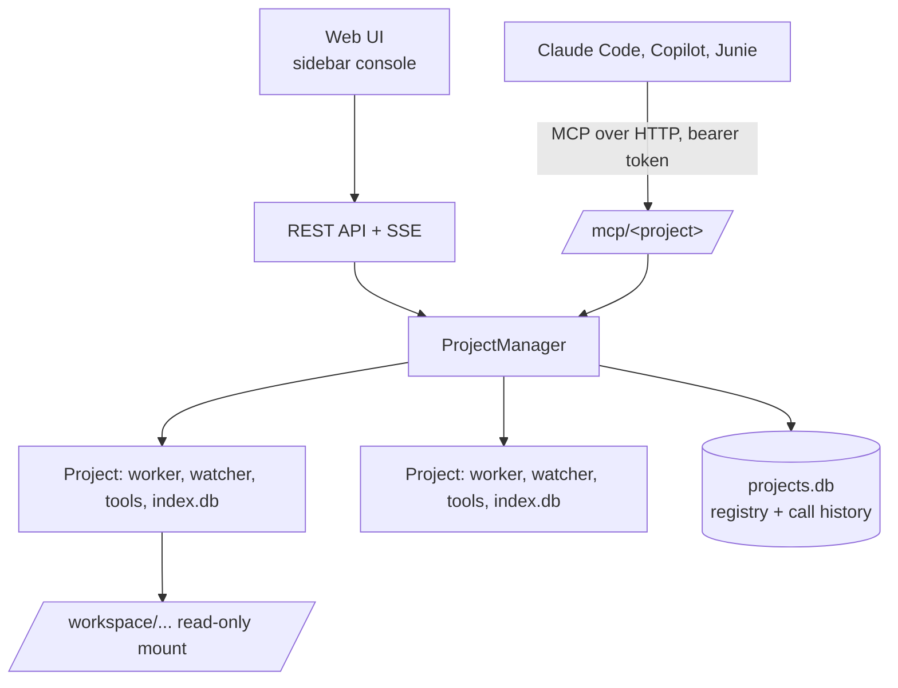

# RefDex Host: Standalone MCP Server Plan

2026-10-08

## Overview and goals

Today RefDex runs inside an IDE: the VS Code extension or the IntelliJ plugin starts the daemon (`refdex serve`) and AI clients start `refdex mcp` over stdio. This plan adds a third way to run it: **RefDex Host**, a standalone server with no IDE involved. It indexes the code itself, serves MCP over HTTP, and has a web page to manage projects and watch what AI clients ask for. It ships as a Docker image on GitHub Container Registry.

- Index several projects, each with its own database.
- Serve each project's MCP tools over HTTP at `/mcp/<project>/`.
- Web UI to add a project by picking a folder, see its status, and see MCP activity.
- Docker image on ghcr.io, run with one `docker run` or a compose file.
- `refdex mcp` and `refdex serve` stay as they are for the IDEs.

## Decisions

| Question | Decision |
| --- | --- |
| UI | Option A, sidebar console: project list on the left, detail on the right (mockups reviewed 2026-10-08) |
| Auth | Token generated on first start, printed in the logs and shown in the UI |
| Package | New `packages/host` |
| IDE entry points | `refdex mcp` and `refdex serve` unchanged |
| Registry | GitHub Container Registry (ghcr.io); optional Docker Hub mirror later |

## What exists and what is missing

Reused as is: the indexer, workers and watcher (`packages/core`, `packages/server/src/serve.ts`, `watcher.ts`, `worker.ts`), the tool logic (`tools.ts`), the server factory (`mcp.ts`) and the usage log format (`usage.ts`).

Missing:

1. **One project per process.** Everything takes a single `root` and `dbPath`. Needs a project registry.
2. **No remote MCP.** `mcp-http.ts` is debug-only, stateless, bound to 127.0.0.1, without auth.
3. **Path mapping.** The index stores absolute paths and tools read source from disk. A container sees `/workspace/x`, the AI client sees `/home/user/x`. Store paths relative to the project root and translate in answers.
4. **Git.** `get_context` with `changes` runs git. The image needs git and a `safe.directory` setting for mounted folders.
5. **File watching.** Bind mounts work with inotify on Linux. Docker Desktop on macOS and Windows often gives no events, so add a polling option and a manual Reindex.
6. **Folder picker.** A browser cannot read host paths. The picker browses what is mounted under `/workspace` in the container.
7. **Usage storage.** The UI needs queryable history, not only a JSONL file.

## Architecture

Data layout in the container: `/data/projects.db`, `/data/<project-id>/index.db`. Source is mounted read-only at `/workspace`.

## Phases

### Phase 0: Refactor for reuse

- Move project-independent logic out of the stdio entry points: the indexing queue from `serve.ts`, and `createServer` / `RefdexTools`.
- Add a `ProjectManager` class that owns one `{root, db, worker, watcher, tools}` per project.
- Store paths relative to the project root; keep the IDE daemon behaving the same.
- Done when: existing `packages/core`, `server` and `vscode` tests pass unchanged, and the IntelliJ plugin still works against the daemon.

### Phase 1: `packages/host` backend

- HTTP server with MCP (Streamable HTTP, sessions) at `/mcp/<project>/`.
- Bearer-token auth for `/mcp` and `/api`. Token generated on first start, stored in `/data`, printed in the logs. `REFDEX_TOKEN` overrides it. Allowed-hosts list for DNS-rebinding protection.
- REST API: list, add, remove, reindex and rebuild projects; per-project stats and index browse; folder listing under `/workspace`.
- `GET /api/events`: server-sent events for indexing progress and new MCP calls.
- `projects.db`: project registry (id, name, root, include/exclude/languages) and call history (time, project, client, tool, arguments, ms, characters, error).
- Done when: an integration test adds a fixture project through the API, waits for `indexed`, and calls the tools through `/mcp/<id>/`.

### Phase 2: Web UI (option A)

- Plain HTML, CSS and a small script served by the same process. No front-end build step.
- Sidebar: project list with state pills (ready, indexing %, error) and "Add project".
- Detail page: header with Reindex / Rebuild / Remove, four counters (files, symbols, calls today, index size), tabs for Activity, Settings, Browse index and Connect clients.
- Add-project dialog with the folder picker, language and include/exclude options.
- Connect clients tab: copy-ready config for Claude Code, Copilot and Junie, with the project's URL and token.
- Light and dark themes.

### Phase 3: Docker image and publishing

- Multi-stage Dockerfile on `node:22-slim` (needs `node:sqlite`, so Node 22.18+). Includes git. Runs as a non-root user.
- Port 7420, `/data` volume, `HEALTHCHECK`.
- `docker-compose.yml` example mounting `~/code:/workspace:ro` and a named volume for `/data`.
- GitHub Actions workflow: build multi-arch (amd64, arm64) and push to `ghcr.io/danielonet/refdex-host` on version tags, with `latest` and version tags. Uses the built-in `GITHUB_TOKEN`.
- Make the package public in GitHub after the first push.

### Phase 4: Tests and docs

- Tests: path mapping, auth (missing and wrong token), two projects staying isolated, watcher and polling fallback, SSE events.
- CI smoke test: build the image, start it, add a fixture, call a tool.
- Docs: README layout table and a "Run in Docker" section, changelog entry, and a note in `packages/vscode/README.md` that the IDE flow is unchanged.

## Risks and open questions

- **Large mounts.** Indexing a big tree over a bind mount on macOS and Windows is slow. Measure, and document recommended settings.
- **Token in logs.** Convenient, but anyone with log access can use it. Document that, and offer `REFDEX_TOKEN` and rotating from the UI.
- **Version skew.** An index written by a different RefDex version is replaced (`replacedOutdated`); a container upgrade will reindex every project. Show this clearly in the UI.
- **Memory.** One worker per project. Decide a limit on projects indexing at the same time.
- **Path translation.** Tools return paths the AI client can open. Decide whether the project settings hold a "host path prefix" for translation, or the tools return project-relative paths only.
