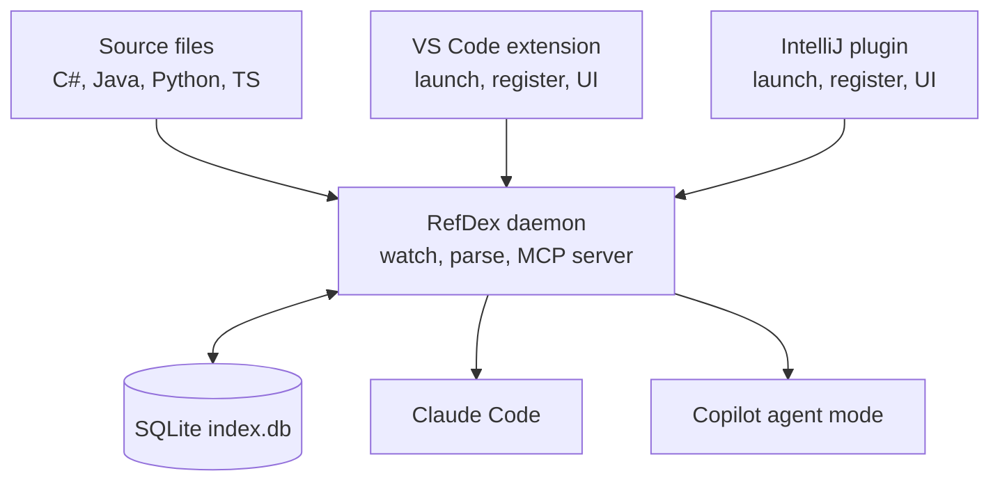

# RefDex — Project Plan

2026-09-22

## Overview and goals

RefDex is a method-level code index for VS Code and IntelliJ. It parses C#, Java, Python and TypeScript into SQLite and serves it to Claude Code and Copilot through an MCP server. The AI queries signatures and outlines on demand instead of reading whole files, which cuts tokens per task.

- Index imports, classes, methods, properties and their relationships across a whole workspace.
- Keep the index fresh with incremental, hash-based updates on save.
- Expose the index as MCP tools usable by Claude Code and Copilot agent mode.
- Share one core (indexer, database, MCP server) between VS Code and IntelliJ; each IDE gets a thin plugin.
- Stay language-agnostic: new languages are added as adapters, not core changes.

Target: 10–12 weeks part-time. Python and TypeScript work end to end in VS Code by week 5; the IntelliJ plugin follows the VS Code release.

## Competitive landscape

Two open-source tools overlap with RefDex; both are mainly CLIs, which leaves room for an IDE-native, refactoring-focused tool.

| Tool | Approach | Overlap | RefDex difference |
| --- | --- | --- | --- |
| SigMap | Writes a regex-extracted signature map into `copilot-instructions.md`; MCP server with 9 tools; VS Code and JetBrains wrappers around a CLI | Signatures, import graph, file-level impact, MCP | On-demand method-level retrieval, tree-sitter parsing, no separate CLI install |
| SymDex | CLI and MCP over a local SQLite index of symbols, routes and call graphs; semantic search | SQLite, symbol search, callers, watch mode | Native VS Code and IntelliJ plugins, auto-setup for Copilot and Claude, deep C# and Java handling |

Positioning: RefDex is the method-level code index for AI refactoring on large C#, Java, Python and TypeScript codebases, with zero setup inside the IDE.

## Architecture

One standalone Node process, the RefDex daemon, watches files, parses them, owns the SQLite database and serves MCP tools. The VS Code extension and IntelliJ plugin are thin shells that launch it, register it with AI clients and provide UI.

- **Daemon (shared, TypeScript):** tree-sitter parsing via `web-tree-sitter`, language adapters, file watching via Node's `fs.watch` (see Phase 1 notes), SQLite writes, and the MCP server (MCP TypeScript SDK, stdio). SQLite is Node's built-in `node:sqlite` (FTS5 included), so there is no native module to package.
- **Distribution:** shipped as a single executable per platform (Node single-executable apps or `bun build --compile`) so users don't need Node installed.
- **VS Code extension (TypeScript):** registers the daemon for Copilot via `vscode.lm.registerMcpServerDefinitionProvider`, writes the Claude Code `.mcp.json` entry, status bar, commands, settings.
- **IntelliJ plugin (Kotlin):** launches the daemon, writes MCP config, status widget, reindex action, settings. Does not use IntelliJ's PSI, so there is only one indexer to maintain.
- **Source code on demand:** the database stores line ranges, not bodies. Code is read from disk when requested, so it is always current.

Repo layout (monorepo): `packages/core` (indexer, adapters, database), `packages/server` (daemon and MCP tools), `packages/vscode`, `plugins/intellij`. About 80–90% of the code is shared.

## Language support

Each language is a `LanguageAdapter` with `parse(file)` and `resolveImport(spec, file)`. The four languages fall into two import families: Python and TypeScript imports point to files; Java and C# imports point to namespaces.

| Language | Grammar | Import family | Project root | Key edge cases |
| --- | --- | --- | --- | --- |
| Python | `python` | Path-based | `pyproject.toml`, `setup.py` | Relative imports, `__init__.py` packages, `src/` layout, decorators |
| TypeScript | `typescript`, `tsx` | Path-based | `tsconfig.json`, `package.json` | `tsconfig` path aliases, `index.ts` barrel re-exports, arrow functions assigned to `const` |
| Java | `java` | Namespace (mirrors folders) | `pom.xml`, `build.gradle` | Static and wildcard imports, inner classes, overloads |
| C# | `c_sharp` | Namespace | `.csproj`, `.sln` | Partial classes across files, global usings, file-scoped namespaces, properties, extension methods |

Prebuilt WASM grammars for all five come from the official grammar packages (`tree-sitter-python`, `tree-sitter-typescript`, `tree-sitter-java`, `tree-sitter-c-sharp`), which ship `.wasm` files. `tree-sitter-wasms` was dropped in Phase 0: its grammars were built with tree-sitter-cli 0.20 and don't load in `web-tree-sitter` 0.27. Java and C# share one namespace-to-files resolver.

## Data model

Six tables hold everything; symbol kinds are normalized so tools work the same across languages.

| Table | Key columns | Purpose |
| --- | --- | --- |
| `files` | id, path, language, hash, indexed_at | One row per file; hash drives incremental updates |
| `symbols` | id, file_id, kind, native_kind, name, qualified_name, namespace, signature, doc, start_line, end_line, parent_id | Classes, methods, properties, etc. |
| `symbol_parts` | symbol_id, file_id, start_line, end_line | Links a C# partial class to every file it spans |
| `imports` | file_id, spec, resolved_file_id, resolved_namespace | Raw import plus where it resolves |
| `edges` | file_id, from_symbol_id, type, name, qualifier, line, to_symbol_id | `calls`, `extends`, `implements`, `references`; unresolved uses have no `to_symbol_id` |
| `symbols_fts` | name, qualified_name, doc | FTS5 index for fast name search |

Normalized kinds: `namespace`, `module`, `class`, `interface`, `enum`, `type_alias`, `function`, `method`, `property`, `field`. The original term (e.g. `record`, `struct`) is kept in `native_kind`.

## MCP tools

The AI gets cheap signatures first and fetches full source only when it needs implementation details. Every result includes file path, line range and index timestamp.

| Tool | Input | Returns | Phase |
| --- | --- | --- | --- |
| `search_symbols` | query, kind?, language? | Matching symbols with signature and location | 2 |
| `get_file_outline` | path | Imports and all symbol signatures in the file | 2 |
| `get_symbol_source` | qualified_name, with_callees? | Source lines read from disk; optional callee signatures | 2 |
| `find_references` | qualified_name | Callers and references from `edges` | 2 |
| `get_repo_map` | token_budget | Most important symbols, ranked by PageRank, trimmed to budget | 4 |

Tool descriptions steer the model, e.g. for `get_symbol_source`: "Call only after search_symbols when you need implementation details."

## AI client detection

Detection is used only for setup and stats; the index and tools behave the same for any MCP client.

| Signal | Where | What it tells you |
| --- | --- | --- |
| `vscode.extensions.getExtension("GitHub.copilot-chat")` | VS Code extension | Copilot Chat is installed |
| `vscode.extensions.getExtension("anthropic.claude-code")` | VS Code extension | Claude Code extension is installed |
| `vscode.lm.selectChatModels()` | VS Code extension | Which language models VS Code exposes |
| Installed plugins API | IntelliJ plugin | Copilot or AI Assistant is installed |
| MCP `initialize` `clientInfo` | Daemon | Which client is calling right now, with version |

- **Auto-setup:** write `.mcp.json` only if Claude Code is present; register the Copilot provider only if Copilot Chat is present.
- **Usage stats:** count tool calls per client in a `client_usage` table; feeds the token-savings measurement.
- Verify extension IDs on each Marketplace page before release.

## Phased plan

Seven phases over 10–12 weeks part-time; Phase 2 is the first usable milestone and Phase 6 adds IntelliJ.

| Phase | Focus | Duration | Cumulative |
| --- | --- | --- | --- |
| 0 | Setup, monorepo and spike | 3–4 days | Week 1 |
| 1 | Core indexer, four languages | 3–4 weeks | Week 4–5 |
| 2 | Daemon and MCP server | 1 week | Week 5–6 |
| 3 | VS Code extension and client detection | 1 week | Week 6–7 |
| 4 | Graph and ranking | 1–2 weeks | Week 7–9 |
| 5 | Hardening and VS Code release | 1 week | Week 8–10 |
| 6 | IntelliJ plugin | 1–2 weeks | Week 10–12 |

### Phase 0: Setup and spike

- [x] Scaffold with `yo code` (TypeScript, esbuild)
- [x] Load `web-tree-sitter` with Python, TypeScript, TSX, Java and C# grammars
- [x] Print symbols from one sample file per language
- [x] Set up the refdex monorepo (core, server, vscode, intellij); confirm SQLite works in the daemon and builds as a single executable
- [ ] Reserve the RefDex name: VS Code publisher ID, JetBrains Marketplace, npm, GitHub, domain
- [ ] Benchmark SigMap and SymDex on a real refactoring task in your own codebase

Phase 0 findings (2026-09-23):

- **Grammars:** `web-tree-sitter` 0.27 cannot load `tree-sitter-wasms` 0.1.13 (old dylink format). The official grammar packages' `.wasm` files load fine. Their native `tree-sitter` peer dependency is skipped with `legacy-peer-deps` in `.npmrc`.
- **SQLite:** `node:sqlite` (Node 22.18+, SQLite 3.51) supports FTS5 and needs no native build. Its ExperimentalWarning is filtered in the daemon.
- **Single executable:** Node SEA works on Linux x64. The daemon is bundled to one CJS file with esbuild, and the runtime and grammar `.wasm` files are embedded as SEA assets. `refdex selftest` passes from the binary run outside the repo. The binary is 129 MB, almost all of it the Node runtime. macOS and Windows builds are still untested.
- **Symbol extraction:** tree-sitter queries find the expected symbols in all five samples, with nesting, qualified names, overloads, partial members, records, arrow functions and decorators. Gaps for Phase 1: TS computed member names (`[Symbol.dispose]`), doc comments, and properties inside TS type literals being reported as symbols.
- **Parse speed:** 10–100 ms per sample file, including first use of each grammar. This is not yet a benchmark.
- **Name:** the npm package name `refdex` was unclaimed on 2026-09-23. The other registrations are still open.

### Phase 1: Core indexer

- [x] Create schema, including `symbols_fts` and `symbol_parts`
- [x] Define `LanguageAdapter` interface and extension-to-adapter registry
- [x] Python and TypeScript adapters with path-based import resolution
- [x] Handle `tsconfig` path aliases and barrel re-exports
- [x] Java adapter plus shared namespace-to-files resolver
- [x] C# adapter with partial-class merging and global usings
- [x] Full workspace scan respecting `.gitignore`
- [x] Hash-based incremental updates via file watcher
- [x] Move indexing to a worker thread

Phase 1 notes (2026-09-23):

- **Layout:** `packages/core` holds the adapters (`src/adapters/`), `Workspace` (scan, `.gitignore`, project roots, tsconfig, workspace packages), `IndexDb` (schema and queries) and `Indexer`. `packages/server` holds the CLI and `refdex serve`.
- **Two-pass indexing:** changed files are parsed and stored with their raw imports, then imports are resolved against the whole index. Each run re-resolves the changed files' imports plus every unresolved import, so a new file can satisfy older imports.
- **Qualified names:** Python uses dotted module paths (`shop.orders.Order.total`), TypeScript uses module path plus `:` (`src/models/order:OrderModel.total`), and Java and C# use package or namespace (`com.acme.model.Invoice.Line`).
- **Import resolution:**
  - Python: relative imports, `src/` layouts and `from pkg import submodule`.
  - TypeScript: tsconfig `paths`/`baseUrl` with `extends` and JSONC, `.js`→`.ts`, index files, and monorepo packages via `package.json` `exports`, mapped back to `src/`.
  - Java: types, nested types, wildcard and static imports.
  - C#: `using`, `using static` and `using X =`. `global using` applies per `.csproj` project.
  - Standard-library and third-party imports stay unresolved.
- **Barrels:** `IndexDb.resolveExport` follows `export *` and `export { a as b } from` to the defining symbol.
- **Partial classes:** the part with the lowest id is canonical, every part is listed in `symbol_parts`, the other parts set `merged_into`, and search shows the type once.
- **Watcher (deviation):** Node's `fs.watch` instead of `@parcel/watcher`, which is a native module and would complicate the single executable and the `.vsix`. macOS and Windows use the native recursive mode. On Linux each non-ignored folder is watched separately, because Node's recursive mode also watches `node_modules`.
- **Daemon:** `refdex serve` speaks JSON lines on stdio. Indexing runs in a worker thread with its own write connection, and queries are answered from a WAL reader. The single executable runs the worker from its embedded bundle.
- **Performance (synthetic, 3,000 TypeScript files, 93k symbols):** full index 8.6 s, no-change rescan 0.5 s, saved file 34 ms through the watcher path. Adding indexes on every foreign key cut the saved-file time from 620 ms.
- **Tests:** a fixture project per language in `packages/core/test/fixtures`. There are 24 core tests and 2 daemon tests; run them with `npm test`.
- **Known gaps:** C# implicit usings (`<ImplicitUsings>`) are not modeled. Python `sys.path` tricks and dynamic imports stay unresolved. A partial type's doc comment comes from its canonical part only.

### Phase 2: MCP server

- [x] Stdio server with MCP TypeScript SDK, read-only database
- [x] `search_symbols`, `get_file_outline`, `get_symbol_source`, `find_references`
- [x] Test with MCP Inspector
- [x] Test with Claude Code on a real project

Phase 2 notes (2026-09-24):

- **Server:** `refdex mcp --root <dir> [--db <file>]` runs a stdio MCP server (MCP TypeScript SDK 1.30, zod 4) over a read-only connection. It starts even without an index, and each tool then explains how to build one. `REFDEX_ROOT` and `REFDEX_DB` can replace the flags in client configs. The default database is `<root>/.refdex/index.db`.
- **Output:** tools return compact plain text: workspace-relative paths, line ranges, signatures and the first sentence of each doc comment. Every answer starts with the index's freshness, and code whose file changed since indexing is flagged. Source is always read from disk.
- **Tool behavior:**
  - `search_symbols` ranks exact name matches first, then prefixes, then full-text relevance.
  - `get_symbol_source` accepts a plain name when it's unique, and lists candidates when it's ambiguous. It returns every overload and partial-class part. A type longer than `max_lines` (default 250) returns its member list instead.
- **`find_references` (interim):** matches the name by word in the files that can see the symbol. Those are its own files, files importing them (following barrel re-exports), and for Java/C# the files sharing or importing its package or namespace (including `global using`). It ignores the declaration line. The call-graph `edges` of Phase 4 will make it exact. `with_callees` moved to Phase 4 together with the edges.
- **MCP Inspector (2.8, CLI with an `mcpServers` config):** the tools list correctly and `--strict` reports no schema portability problems.
- **Claude Code (2.1.281, Pyrite repo):** asked where `RuleBasedTranslator.translate` is and who calls `createTranslator`, it used `get_symbol_source` and `find_references` unprompted. It answered correctly (checked against grep) in 4 turns with about 2.3 KB of tool output.

### Phase 3: VS Code extension and client detection

- [x] VS Code extension launches the daemon and shows status
- [x] Detect Copilot Chat and Claude Code extensions
- [x] Register server for Copilot with `registerMcpServerDefinitionProvider` when Copilot is present
- [x] Command that writes the Claude Code `.mcp.json` entry when Claude Code is present
- [x] Log MCP `clientInfo` and tool calls per client
- [x] Status bar indicator and "Reindex workspace" command
- [x] Settings: include/exclude globs, enabled languages

Phase 3 notes (2026-09-24):

- **MCP command:** AI clients start `<VS Code runtime> dist/daemon/refdex.cjs mcp --root <folder> --db <index>` with `ELECTRON_RUN_AS_NODE=1`, so no Node install is needed. The index stays in VS Code's per-workspace storage.
- **Copilot:** `GitHub.copilot-chat` (built into VS Code 1.137 as 0.65) is detected, and RefDex registers through `vscode.lm.registerMcpServerDefinitionProvider` (`contributes.mcpServerDefinitionProviders`: `refdex.mcp`).
- **Claude Code:** "RefDex: Connect Claude Code…" offers two scopes, and nothing is written unless the user picks one:
  - *This project, only for me* (default): `claude mcp add-json --scope local`, using the `claude` CLI on PATH or the one bundled with the Claude Code extension.
  - *.mcp.json*: merged into the root file, keeping other servers. It holds machine paths, so it is not meant to be committed.
- **Offer and upkeep:** after the first index, if Claude Code is installed and not connected, RefDex offers to connect once per workspace. When an extension update moves the bundled daemon, an existing entry is rewritten.
- **Verified:** Claude Code 2.1.281 reports the local entry as "✔ Connected".
- **Usage log:** the MCP server appends one JSON line per tool call (client name and version from `initialize`, tool, ms, characters returned) to `mcp-usage.jsonl` beside the index, rotated at 2 MB. The extension watches it: the status report shows calls per client and approximate tokens returned, and the About view shows each client's state. This log also feeds the Phase 5 token measurement.
- **Settings:** `refdex.include` (gitignore-style allow list) and `refdex.languages` join `refdex.exclude` and `refdex.watch`; any change restarts the daemon.
- **Deviation:** the plan's `client_usage` table became a JSONL file, because the MCP server's database connection is read-only.
- **Open:** Copilot's `clientInfo` name is assumed to be "Visual Studio Code" (VS Code's product name) until a real agent-mode session confirms it.

### Phase 4: Graph and ranking

- [x] Extract call, inheritance and implementation edges
- [x] PageRank over the reference graph
- [x] `get_repo_map` tool with token budget
- [x] `with_callees` option on `get_symbol_source`

Phase 4 notes (2026-09-24):

- **Extraction:** each adapter has a second tree-sitter query, `references`, for calls (`f()`, `obj.m()`, `new C()`), base types and type annotations. Each use is stored with its name, its qualifier as written (`this`, `self`, `super`, `ns`, `Util`, `a.b`), its line and the innermost enclosing symbol, which is null at module level. C# base lists are stored as `extends` and become `implements` when the target is an interface.
- **Every use is stored, resolved or not** (schema version 4, so older indexes rebuild). When a file is re-indexed, edges into it lose their target and are resolved again by name. Unresolved edges are how a new declaration finds the uses that meant it.
- **Resolution is by scope, not by type inference:**
  - For unqualified names: enclosing declarations first. That means lexical scope in TypeScript and Python, and members of the enclosing types and their base types in Java and C#. Then imports (named imports through barrels, Python module aliases, Java single-type and static imports, C# `using static` and aliases), then the package or namespace.
  - `this.m()` and `super.m()` look in the enclosing type and its resolved bases. `Type.m()` and `module.m()` look in that type or module.
  - `obj.m()` with an unknown receiver resolves only if exactly one visible type declares `m`. Capitalized receivers that aren't indexed types (`String`, `Math`, `vscode.Uri`) are treated as external. Standard collection and string methods (`get`, `clear`, `join`, …) are never guessed.
  - Anything ambiguous stays unresolved. find_references and the repo map depend on these edges, so precision matters more than recall.
- **Incremental updates:** a file keeps its row id when re-indexed, so imports of it stay resolved. A save re-resolves:
  - the file's own edges;
  - edges that pointed into it;
  - unresolved edges named like one of its declarations, but only in files that can see it: importers, including through barrels, and for Java/C# the same or imported package/namespace;
  - all edges of files whose imports changed, or that imported a removed file.
- **Tools:**
  - `find_references` lists the linked uses first, each with its calling symbol. Other lines naming the symbol in the files that can see it follow: imports, and values passed around.
  - `get_symbol_source` with `with_callees` appends the signatures of the indexed symbols it calls, plus the names of unlinked calls.
  - `get_repo_map(token_budget, path?)` ranks symbols with PageRank (damping 0.85, square-root edge weights) over the resolved graph. It adds symbols in rank order, each with its enclosing types, until about 4 characters per token of the budget are used, then groups them by file in rank order. Fields and properties are left out unless something uses them. Ranks are computed in the MCP server and cached until the index changes.
- **Real repos:** RefDex links 1,239 of 3,717 uses and Pyrite 1,428 of 4,557. The unlinked ones are mostly library calls. A random sample of 30 Pyrite links was all correct.
- **Performance (same synthetic 3,000-file TypeScript project, now with 450k uses):**
  - Full index: 26 s (was 8.6 s). About 3 s of it is the second query and extraction, the rest is storing and resolving edges. A first index into an empty database writes edges without their secondary indexes and creates them afterwards.
  - Saved file: 37–56 ms (was 34 ms).
  - No-change rescan: 0.5 s.
  - Repo map on this project: 1.4 s to read the graph and rank it, once per index change.
  - Lookups of very common names (`get`, or `m0` declared 3,000 times here) use indexed per-parent, per-file and per-namespace queries. A first index loads all symbols once.
- **Tests:** `packages/core/test/graph.test.ts` covers edges in all four languages, re-linking after edits, renames and removals, and PageRank. The server tests cover the new tool outputs. Core has 34 tests and the server 19.
- **Known gaps:**
  - There's no type inference: calls on locals, parameters and fields of a known type resolve only when the method name is unique among visible types.
  - Functions passed as values, decorators with arguments beyond the call itself, and Python `getattr`/dynamic dispatch aren't linked.
  - Constructor calls link to the class, not to a particular constructor overload.

Tools only where they pay off (2026-09-25):

- **Fixed cost:** the five tool definitions and the instructions are about 4,700 characters, roughly 1,200 tokens, sent with every client request. On a small codebase, reading files costs less.
- **Gate:** `refdex mcp --tools auto|always|never --min-tokens N` (or `REFDEX_TOOLS`/`REFDEX_MIN_TOKENS`). In `auto`, the tools are offered when the indexed source reaches N estimated tokens (4 characters each, summed from the new `files.chars` column, schema 5). The default is 100,000.
  - Below the threshold the server lists no tools and sends a one-line instruction instead of the full one.
  - It re-checks every minute and enables the tools once the codebase is big enough. The client is told the tool list changed.
  - All tools are registered before connecting and then disabled, since the SDK can't add the tools capability later.
- **Extension:** it applies the same rule. Copilot's provider returns no server while the tools are off, so Copilot doesn't start RefDex at all, and Claude Code isn't offered a connection. The status report, About view and log show the decision and its reason. The `refdex.aiTools` and `refdex.aiToolsMinTokens` settings are passed to every MCP command.
- **Open:** 100,000 is a heuristic. The Phase 5 token benchmark should set it from measurements.

### Phase 5: Hardening and VS Code release

- [ ] Fixture repo per language covering its edge cases
- [ ] Performance test on a large repo
- [ ] Token-usage comparison with and without the index
- [ ] Package `.vsix` and publish to the Marketplace

### Phase 6: IntelliJ plugin

- [ ] Scaffold Kotlin plugin with the IntelliJ Platform Gradle plugin
- [ ] Launch the bundled daemon executable per platform
- [ ] Detect installed AI plugins and write MCP config
- [ ] Status widget, "Reindex project" action, settings page
- [ ] Confirm current MCP support in Copilot for JetBrains and JetBrains AI Assistant
- [ ] Publish to the JetBrains Marketplace

## Testing and success metrics

The project succeeds if the AI completes the same tasks with noticeably fewer tokens and no loss in accuracy.

| Metric | How to measure | Target |
| --- | --- | --- |
| Token savings | Same 10 tasks run with and without the index | Open question: set after first baseline |
| Symbol accuracy | Fixture repos with expected symbol lists | All expected symbols found per language |
| Import resolution | Fixture imports with known targets | All resolvable imports resolved |
| Incremental update time | Save one file in a large repo | Under 1 second |
| Full index time | Large open-source repo per language | Open question: set after Phase 0 spike |

Fixture repos cover broken code, very large files, `tsconfig` aliases, partial classes and relative Python imports.

## Risks and mitigations

The biggest early risk is packaging the daemon with SQLite as a single executable, so Phase 0 tests it first.

| Risk | Impact | Mitigation |
| --- | --- | --- |
| Daemon with SQLite fails to build as a single executable on some platform | Blocks both IDEs | Works on Linux x64 with `node:sqlite` (Phase 0); verify macOS and Windows in CI; fall back to a WASM SQLite build |
| JetBrains AI clients have limited MCP support | IntelliJ plugin less useful | Confirm support before Phase 6; Claude Code works from any terminal regardless |
| Stale index misleads the AI | Wrong answers | Hash-based updates; timestamps in every result; source read from disk |
| C# namespace and partial-class resolution is complex | Phase 1 overruns | Build C# last, reusing the Java resolver |
| Python dynamic imports can't be resolved statically | Missing edges | Record as unresolved; don't guess |
| Large repos slow indexing | Poor UX | Separate daemon process, batched writes, exclude globs |
| Extension IDs or client names change | Detection breaks | Use detection only for setup and stats, never core behavior |
| Existing tools already cover the need | Wasted effort | Benchmark SigMap and SymDex in Phase 0; differentiate on method-level refactoring, IDE-native setup and deep C#/Java support |

## Future work

- More languages (Go, Kotlin, Rust) as new adapters
- Language-server references via `vscode.executeReferenceProvider` for more accurate cross-file edges
- Optional embeddings for semantic search
- A Copilot chat participant (`@refdex`) for users without agent mode
